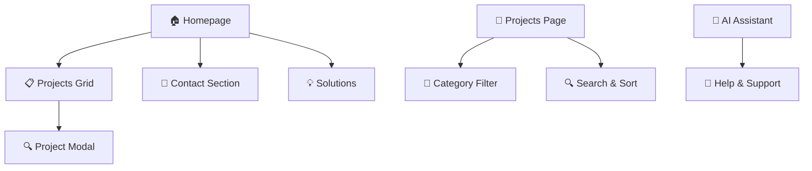

<div align="center">

# 🧠✨ BrainyBox
### *Premium Source Code Marketplace for Developers*


[](https://github.com/sairohithtapaptla/BrainyBox/stargazers)
[](https://github.com/sairohithtapaptla/BrainyBox/network)
[](https://github.com/sairohithtapaptla/BrainyBox/issues)
[](https://lovable.dev/projects/6ce39f5a-97d7-43e8-b302-42ade8fb3592)


</div>

---

## 🚀 What is BrainyBox?

<div align="center">

</div>

**BrainyBox** is the ultimate destination for premium source code projects! 🎯

> *"Where brilliant minds showcase their innovations and connect with fellow creators"*

🌟 **Discover** amazing projects from talented developers  
💡 **Showcase** your own coding masterpieces  
🤝 **Connect** with a community of passionate creators  
🛒 **Marketplace** for buying and selling premium code  

---

## ✨ Features That Make Us Special

<table>
<tr>
<td width="50%">

### 🎨 **Beautiful Design**
- Modern, responsive UI/UX
- Dark/Light theme support
- Smooth animations & transitions
- Mobile-first approach

### 🛡️ **Robust Architecture**
- TypeScript for type safety
- Component-based architecture
- SEO-friendly structure
- Performance optimized

</td>
<td width="50%">

### 🔥 **Interactive Elements**
- Project showcase with modals
- Smart navigation system
- Contact form with email integration
- Floating AI assistant

### 🚀 **Developer Experience**
- Hot reload development
- Modern build tools
- Clean code structure
- Easy deployment

</td>
</tr>
</table>

---

## 🛠️ Tech Stack

<div align="center">


</div>

### 🏗️ Architecture Highlights



---

## 🚀 Quick Start Guide

<details>
<summary>🔧 <strong>Prerequisites</strong></summary>

- Node.js 18+ 
- npm or yarn
- Git

</details>

### 1️⃣ Clone the Repository

```bash
# 📥 Clone the awesome BrainyBox repo
git clone https://github.com/sairohithtapaptla/BrainyBox.git

# 📂 Navigate to the project
cd BrainyBox
```

### 2️⃣ Install Dependencies

```bash
# 📦 Install all the magical packages
npm install

# ⚡ Or use yarn if you prefer
yarn install
```

### 3️⃣ Start Development Server

```bash
# 🚀 Launch the development server
npm run dev

# 🌐 Your app will be available at http://localhost:5173
```

### 4️⃣ Build for Production

```bash
# 🏗️ Create production build
npm run build

# 👀 Preview the production build
npm run preview
```

---

## 📁 Project Structure

```
🧠 BrainyBox/
├── 📂 public/           # Static assets
├── 📂 src/
│   ├── 📂 components/   # Reusable UI components
│   │   ├── 🧩 Header.tsx
│   │   ├── 🏠 HeroSection.tsx
│   │   ├── 📋 ProjectsGrid.tsx
│   │   ├── 📧 ContactSection.tsx
│   │   └── 🤖 FloatingAIBot.tsx
│   ├── 📂 pages/        # Main page components
│   │   ├── 🏠 Index.tsx
│   │   └── 📋 Projects.tsx
│   ├── 📂 context/      # React context providers
│   ├── 📂 lib/          # Utility functions
│   └── 📄 main.tsx      # App entry point
├── 📄 package.json      # Dependencies & scripts
└── 📄 README.md         # You are here! 👋
```

---

## 🎨 Customization Guide

<details>
<summary>🎭 <strong>Theme Customization</strong></summary>

### Colors
Edit `tailwind.config.js` to customize the color palette:

```javascript
colors: {
  coral: '#E26D5A',      // Primary brand color
  raspberry: '#C4405B',   // Secondary brand color
  lavender: '#8B5CF6',   // Accent color
  cream: '#FAF9F6',      // Background light
  charcoal: '#2D3748'    // Text dark
}
```

### Fonts
Update font families in your CSS:

```css
font-family: 'Poppins', 'Inter', sans-serif;
```

</details>

<details>
<summary>📧 <strong>Contact Form Setup</strong></summary>

1. Sign up at [Web3Forms](https://web3forms.com) (FREE)
2. Get your access key
3. Update `ContactSection.tsx`:

```typescript
access_key: 'YOUR_WEB3FORMS_ACCESS_KEY'
to_email: 'your-email@gmail.com'
```

</details>

---

## 🌟 Features Showcase

<div align="center">

### 🏠 **Homepage**
*Clean, modern design with smooth animations*

### 📋 **Projects Gallery**
*Interactive project showcase with detailed modals*

### 📧 **Smart Contact Form**
*Direct email integration with Web3Forms*

### 🌙 **Theme Toggle**
*Seamless dark/light mode switching*


</div>

---

## 🤝 Contributing

We love contributions! Here's how you can help make BrainyBox even better:

<table>
<tr>
<td>

### 🐛 **Found a Bug?**
1. Check existing issues
2. Create a detailed bug report
3. Include steps to reproduce

</td>
<td>

### 💡 **Have an Idea?**
1. Check feature requests
2. Open a new discussion
3. Describe your idea clearly

</td>
</tr>
<tr>
<td>

### 🔧 **Want to Code?**
1. Fork the repository
2. Create a feature branch
3. Make your changes
4. Submit a pull request

</td>
<td>

### 📚 **Improve Docs?**
1. Fix typos or unclear sections
2. Add examples
3. Update outdated information

</td>
</tr>
</table>

---

## 📈 Project Stats

<div align="center">


</div>

---

## 🎯 Roadmap

- [ ] 🔐 User authentication system
- [ ] 💰 Payment integration for marketplace
- [ ] 🔍 Advanced search & filtering
- [ ] ⭐ Rating & review system
- [ ] 📱 Mobile app development
- [ ] 🤖 AI-powered project recommendations
- [ ] 🌍 Multi-language support
- [ ] 📊 Analytics dashboard

---

## 📞 Get in Touch

<div align="center">

[](mailto:sairohithtappatla45@gmail.com)
[](https://linkedin.com/in/your-profile)
[](https://twitter.com/your-handle)

</div>

---

## 📜 License

<div align="center">

This project is licensed under the **MIT License** - see the [LICENSE](LICENSE) file for details.

[](https://choosealicense.com/licenses/mit/)

</div>

---

<div align="center">

### 🙏 **Thank You for Visiting BrainyBox!**

&nbsp;&nbsp;&nbsp;&nbsp;&nbsp;&nbsp;

**Made with ❤️ by passionate developers for the developer community**

*If you found this project helpful, please consider giving it a ⭐*


---

**🚀 Ready to build something amazing? Let's code the future together! 🚀**

</div>
